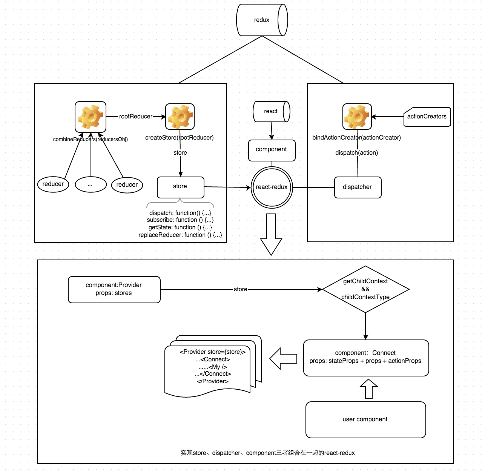

## 解读redux工作原理

## 1. 前言

随着WEB应用变得越来越复杂，再加上node前后端分离越来越流行，那么对数据流动的控制就显得越发重要。redux是在flux的基础上产生的，基本思想是保证数据的单向流动，同时便于控制、使用、测试。

redux不依赖于任意框架(库)，只要subscribe相应框架(库)的内部方法，就可以使用该应用框架保证数据流动的一致性。

那么如何使用redux呢？下面一步步进行解析，并带有源码说明，不仅做到***知其然***，还要做到***知其所以然***。

## 2. 主干逻辑介绍(createStore)

### 2.1 简单demo入门

先来一个直观的认识：

	// 首先定义一个改变数据的plain函数，成为reducer
	function count (state, action) {
	  var defaultState = {
	    year: 2015,
	  };
	  state = state || defaultState;
	  switch (action.type) {
	    case 'add':
	      return {
	        year: state.year + 1
	      };
	    case 'sub':
	      return {
	        year: state.year - 1
	      }
	    default :
	      return state;
	    }
	  }

	// store的创建
	var createStore = require('redux').createStore;
	var store = createStore(count);

	// store里面的数据发生改变时，触发的回调函数
	store.subscribe(function () {
	  console.log('the year is: ', store.getState().year);
	});

	// action: 触发state改变的唯一方法(按照redux的设计思路)
	var action1 = { type: 'add' };
	var action2 = { type: 'add' };
	var action3 = { type: 'sub' };

	// 改变store里面的方法
	store.dispatch(action1); // 'the year is: 2016
	store.dispatch(action2); // 'the year is: 2017
	store.dispatch(action3); // 'the year is: 2016

### 2.2 挖掘createStore实现

为了说明主要问题，仅列出其中的关键代码，全部代码，可以点击[这里](https://github.com/rackt/redux/blob/master/src/createStore.js)阅读。

**a** 首先看createStore到底都返回的内容:

	export default function createStore(reducer, initialState) {
	  ...
	  return {
	    dispatch,
	    subscribe,
	    getState,
	    replaceReducer
	  }
	}

每个属性的含义是:
- dispatch: 用于action的分发，改变store里面的state
- subscribe: 注册listener，store里面state发生改变后，执行该listener
- getState: 读取store里面的state
- replaceReducer: 替换reducer，改变state修改的逻辑

**b** 关键代码解析

	export default function createStore(reducer, initialState) {
	  // 这些都是闭包变量
	  var currentReducer = reducer
	  var currentState = initialState
	  var listeners = []
	  var isDispatching = false;

	  // 返回当前的state
	  function getState() {
	    return currentState
	  }

	  // 注册listener，同时返回一个取消事件注册的方法
	  function subscribe(listener) {
	    listeners.push(listener)
	    var isSubscribed = true

	    return function unsubscribe() {
	      if (!isSubscribed) {
		     return
	      }
	      isSubscribed = false
	      var index = listeners.indexOf(listener)
	      listeners.splice(index, 1)
	    }
	  }
	  // 通过action该改变state，然后执行subscribe注册的方法
	  function dispatch(action) {
	    try {
	      isDispatching = true
	      currentState = currentReducer(currentState, action)
	    } finally {
	      isDispatching = false
	    }
	    listeners.slice().forEach(listener => listener())
	    return action
	  }
	  
	  // 替换reducer，修改state变化的逻辑
	  function replaceReducer(nextReducer) {
	    currentReducer = nextReducer
	    dispatch({ type: ActionTypes.INIT })
	  }
	  // 初始化时，执行内部一个dispatch，得到初始state
	  dispatch({ type: ActionTypes.INIT })
	}

如果还按照2.1的方式进行开发，那跟flux没有什么大的区别，需要手动解决很多问题，那redux如何将整个流程模板化(Boilerplate)呢?

## 3. 保证store的唯一性

随着应用越来越大，一方面，不能把所有的数据都放到一个reducer里面，另一方面，为每个reducer创建一个store，后续store的维护就显得比较麻烦。如何将二者统一起来呢？

### 3.1 demo入手

通过combineReducers将多个reducer合并成一个rootReducer:

	// 创建两个reducer: count year
	function count (state, action) {
	  state = state || {count: 1}
	  switch (action.type) {
	    default:
	      return state;
	  }
	}
	function year (state, action) {
	  state = state || {year: 2015}
	  switch (action.type) {
	    default:
	      return state;
	  }
	}

	// 将多个reducer合并成一个
	var combineReducers = require('redux').combineReducers;
	var rootReducer = combineReducers({
	  count: count,
	  year: year,
	});

	// 创建store，跟2.1没有任何区别
	var createStore = require('redux').createStore;
	var store = createStore(rootReducer);

	var util = require('util');
	console.log(util.inspect(store));
	//输出的结果，跟2.1的store在结构上不存在区别
    // { dispatch: [Function: dispatch],
    //   subscribe: [Function: subscribe],
    //   getState: [Function: getState],
    //   replaceReducer: [Function: replaceReducer]
    // }

### 3.2 源码解析combineReducers

	// 高阶函数，最后返回一个reducer
	export default function combineReducers(reducers) {
	  // 提出不合法的reducers, finalReducers就是一个闭包变量
	  var finalReducers = pick(reducers, (val) => typeof val === 'function')
	  // 将各个reducer的初始state均设置为undefined
	  var defaultState = mapValues(finalReducers, () => undefined)

	  // 一个总reducer，内部包含子reducer
	  return function combination(state = defaultState, action) {
	    var finalState = mapValues(finalReducers, (reducer, key) => {
	      var previousStateForKey = state[key]
	      var nextStateForKey = reducer(previousStateForKey, action)
	      hasChanged = hasChanged || nextStateForKey !== previousStateForKey
	      return nextStateForKey
	    );
	    return hasChanged ? finalState : state
	  }
	  
	}

## 4. 自动实现dispatch

### 4.1 demo介绍

在2.1中，要执行state的改变，需要手动dispatch:

	var action = { type: '***', payload: '***'};
	dispatch(action);

手动dispatch就显得啰嗦了，那么如何自动完成呢?

	var bindActionCreators = require('redux').bindActionCreators;
	// 可以在具体的应用框架隐式进行该过程(例如react-redux的connect组件中)
	bindActionCreators(action)

### 4.2 源码解析
	// 隐式实现dispatch
	function bindActionCreator(actionCreator, dispatch) {
	  return (...args) => dispatch(actionCreator(...args))
	}

	export default function bindActionCreators(actionCreators, dispatch) {
	  if (typeof actionCreators === 'function') {
	    return bindActionCreator(actionCreators, dispatch)
	  }
	  return mapValues(actionCreators, actionCreator =>
	    bindAQctionCreator(actionCreator, dispatch)
	  )
	}

## 5. 支持插件 - 对dispatch的改造

### 5.1 插件使用demo

一个action可以是同步的，也可能是异步的，这是两种不同的情况， dispatch执行的时机是不一样的:

	// 同步的action creator, store可以默认实现dispatch
	function add() {
	  return { tyle: 'add' }
	}
	dispatch(add());

	// 异步的action creator，因为异步完成的时间不确定，只能手工dispatch
	function fetchDataAsync() {
	  return function (dispatch) {
	    requst(url).end(function (err, res) {
	      if (err) return dispatch({ type: 'SET_ERR', payload: err});
	      if (res.status === 'success') {
	        dispatch({ type: 'FETCH_SUCCESS', payload: res.data });
	      }
	    })
	  }
	}

下面的问题就变成了，如何根据实际情况实现不同的dispatch方法，也即是根据需要实现不同的moddleware:

	// 普通的dispatch创建方法
	var store = createStore(reducer, initialState);
	console.log(store.dispatch);

	// 定制化的dispatch
	var applyMiddleware = require('redux').applyMiddleware;
	// 实现action异步的middleware
	var thunk = requre('redux-thunk');
	var store = applyMiddleware([thunk])(createStore);
	// 经过处理的dispatch方法
	console.log(store.dispatch);

### 5.2 源码解析
	// next: 其实就是createStore
	export default function applyMiddleware(...middlewares) {
	  return (next) => (reducer, initialState) => {
	    var store = next(reducer, initialState)
	    var dispatch = store.dispatch
	    var chain = []

	    var middlewareAPI = {
	      getState: store.getState,
	      dispatch: (action) => dispatch(action)
	    }
	    chain = middlewares.map(middleware => middleware(middlewareAPI))
	    dispatch = compose(...chain)(store.dispatch)

	    return {
	      ...store,
	      dispatch // 实现新的dispatch方法
	    }
	  }
	}
	// 再看看redux-thunk的实现, next就是store里面的上一个dispatch
	function thunkMiddleware({ dispatch, getState }) {
	  return function(next) {
	    return function(action) {
	      typeof action === 'function' ? action(dispatch, getState) : next(action);
	    }
	  }
	  
	  return next => action =>
	    typeof action === 'function' ?
	      action(dispatch, getState) :
	      next(action);
	 }

## 6. 与react框架的结合

### 6.1 基本使用

目前已经有现成的工具`react-redux`来实现二者的结合:

	var rootReducers = combineReducers(reducers);
	var store = createStore(rootReducers);
	var Provider = require('react-redux').Provider;
	// App 为上层的Component
	class App extend React.Component{
	  render() {
	    return (
	      <Provier store={store}>
	        <Container />
	      </Provider>
	    );
	  }
	}

	// Container作用: 1. 获取store中的数据; 2.将dispatch与actionCreator结合起来
	var connect = require('react-redux').connect;
	var actionCreators = require('...');
	// MyComponent是与redux无关的组件
	var MyComponent = require('...');

	function select(state) {
	  return {
	    count: state.count
	  }
	}
	export default connect(select, actionCreators)(MyComponent)

### 6.2 Provider -- 提供store

React通过[Context](https://facebook.github.io/react/docs/context.html)属性，可以将属性(props)直接给子孙component，无须通过props层层传递, Provider仅仅起到获得store，然后将其传递给子孙元素而已:

	export default class Provider extends Component {
	  getChildContext() { // getChildContext: 将store传递给子孙component
	    return { store: this.store }
	  }

	  constructor(props, context) {
	    super(props, context)
	    this.store = props.store
	  }

	  componentWillReceiveProps(nextProps) {
	    const { store } = this
	    const { store: nextStore } = nextProps

	    if (store !== nextStore) {
	      warnAboutReceivingStore()
	    }
	  }

	  render() {
	    let { children } = this.props
	    return Children.only(children)
	  }
	}

### 6.3 connect -- 获得store及dispatch(actionCreator)

connect是一个高阶函数，首先传入mapStateToProps、mapDispatchToProps，然后返回一个生产`Component`的函数(wrapWithConnect)，然后再将真正的Component作为参数传入wrapWithConnect(MyComponent)，这样就生产出一个经过包裹的Connect组件，该组件具有如下特点:

- 通过this.context获取祖先Component的store
- props包括stateProps、dispatchProps、parentProps,合并在一起得到`nextState`，作为props传给真正的Component
- componentDidMount时，添加事件this.store.subscribe(this.handleChange)，实现页面交互
- shouldComponentUpdate时判断是否有避免进行渲染，提升页面性能，并得到nextState
- componentWillUnmount时移除注册的事件this.handleChange
- 在非生产环境下，带有热重载功能

主要的代码逻辑:

	export default function connect(mapStateToProps, mapDispatchToProps, mergeProps, options = {}) {
	  return function wrapWithConnect(WrappedComponent) {
	    class Connect extends Component {
	      constructor(props, context) {
	        // 从祖先Component处获得store
	        this.store = props.store || context.store
	        this.stateProps = computeStateProps(this.store, props)
	        this.dispatchProps = computeDispatchProps(this.store, props)
	        this.state = { storeState: null }
	        // 对stateProps、dispatchProps、parentProps进行合并
	        this.updateState()
	      }
	      shouldComponentUpdate(nextProps, nextState) {
	        // 进行判断，当数据发生改变时，Component重新渲染
	        if (propsChanged || mapStateProducedChange || dispatchPropsChanged) {
	          this.updateState(nextProps)
	            return true
	          }
	        }
	        componentDidMount() {
	          // 改变Component的state
	          this.store.subscribe(() = {
	            this.setState({
	              storeState: this.store.getState()
	            })
	          })
	        }
	        render() {
	          // 生成包裹组件Connect
	          return (
	            <WrappedComponent {...this.nextState} />
	          )
	        }
	      }
	      Connect.contextTypes = {
	        store: storeShape
	      }
	      return Connect;
	    }
	  }

## 7. redux与react-redux关系图

